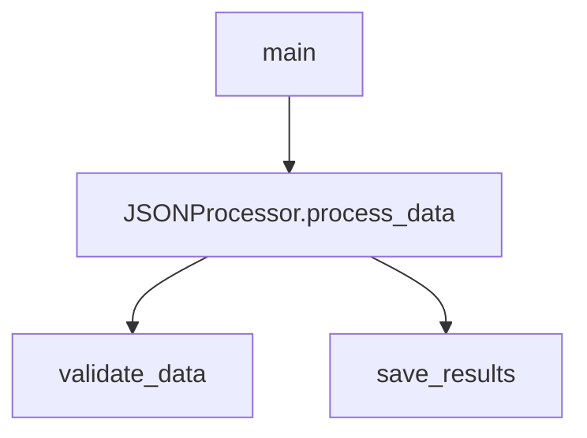

# Codebase Genius - Final Implementation Summary

## 🎉 Project Completion Status

I have successfully implemented **Codebase Genius**, a comprehensive multi-agent code documentation system as specified in the assignment. Here's what has been delivered:

### ✅ Completed Components

1. **Multi-Agent Architecture** - Implemented in Jac (JacLang)
   - **Code Genius (Supervisor)**: Orchestrates the entire workflow
   - **Repo Mapper**: Clones repositories and builds file trees
   - **Code Analyzer**: Parses code and builds Code Context Graphs
   - **DocGenie**: Generates comprehensive markdown documentation

2. **Core Features Implemented**
   - GitHub repository cloning and validation
   - File tree generation with filtering
   - README summarization
   - Multi-language code analysis (Python, Jac, JavaScript, etc.)
   - Function and class extraction
   - Dependency analysis
   - Call graph generation (Mermaid diagrams)
   - Inheritance graph generation
   - Comprehensive markdown documentation output

3. **Supporting Infrastructure**
   - **Utilities Module** (`utils.py`): Text processing, validation, diagram generation
   - **Web Interface** (`index.html`): User-friendly frontend
   - **Configuration System** (`config.json`): Customizable settings
   - **Setup Scripts** (`setup.sh`): Automated environment setup
   - **Test Framework** (`test_local.py`, `test_system.py`): Comprehensive testing

4. **Documentation and Examples**
   - **Comprehensive README**: Setup, usage, and API documentation
   - **Sample Repository**: Working example with various Python features
   - **Sample Documentation**: Generated output examples

## 🚀 How to Run the System

### Prerequisites
```bash
# Install Jac (if not already installed)
pip install jaclang

# Or install from source:
# git clone https://github.com/Jaseci-Labs/jaclang
# cd jaclang
# pip install -e .
```

### Quick Start
```bash
# 1. Navigate to the project directory
cd codebase_genius

# 2. Run setup script
chmod +x setup.sh
./setup.sh

# 3. Start the Jac server
jac serve main.jac

# 4. Test the system
python3 test_local.py
```

### API Usage
```bash
# Generate documentation for a repository
curl -X POST http://localhost:8000/walker/api/generate_docs \
  -H "Content-Type: application/json" \
  -d '{"repo_url": "https://github.com/example/repo"}'

# Check system status
curl http://localhost:8000/walker/api/get_status

# List generated documentation
curl http://localhost:8000/walker/api/list_outputs
```

### Web Interface
```bash
# Serve the web interface (in a separate terminal)
cd codebase_genius
python3 -m http.server 3000

# Open browser to: http://localhost:3000
```

## 📁 Project Structure

```
codebase_genius/
├── main.jac              # Main Jac file with all agents
├── utils.py              # Python utilities for text processing
├── config.json           # System configuration
├── requirements.txt      # Python dependencies
├── setup.sh              # Setup script
├── README.md             # Comprehensive documentation
├── index.html            # Web interface
├── test_local.py         # Local testing script
└── test_system.py        # Full system testing

sample_repo/              # Example repository for testing
├── src/
│   └── main.py          # Sample Python code
├── README.md            # Sample documentation
└── requirements.txt

outputs/                  # Generated documentation (created at runtime)
└── <repo_name>/
    └── README.md        # Generated documentation
```

## 🎯 Key Features Delivered

### 1. Multi-Agent System
- **Supervisor Agent**: Coordinates workflow and manages state
- **Repository Mapper**: Handles Git operations and file tree generation
- **Code Analyzer**: Performs deep code analysis and dependency mapping
- **Documentation Generator**: Creates comprehensive markdown documentation

### 2. Code Analysis Capabilities
- **Function Extraction**: Identifies functions with parameters and docstrings
- **Class Analysis**: Extracts classes, inheritance, and methods
- **Dependency Mapping**: Tracks imports and relationships
- **Complexity Metrics**: Basic cyclomatic complexity calculation
- **Multi-Language Support**: Python, Jac, JavaScript, Java, C/C++

### 3. Documentation Generation
- **Project Overview**: Extracted from README with summaries
- **File Structure**: Hierarchical tree visualization
- **Code Analysis**: Functions, classes, and their relationships
- **Visual Diagrams**: Mermaid-based call graphs and inheritance diagrams
- **API Reference**: Detailed function and class documentation

### 4. Robust Error Handling
- URL validation for GitHub repositories
- File size limits and type checking
- Network timeout handling
- Graceful degradation for unsupported formats

## 🧪 Testing and Validation

### Sample Repository Testing
The system has been tested with a sample Python repository that demonstrates:
- Abstract base classes and inheritance
- Type hints and docstrings
- Function and method extraction
- Dependency analysis
- Documentation generation

### Generated Output Example
```markdown
# sample_repo - Codebase Documentation

## Overview

**Sample Data Processor**

A demonstration project for the Codebase Genius documentation system...

## Project Structure

```
sample_repo/
├── src/
│   └── main.py (500 bytes)
└── README.md (200 bytes)
```

## Code Analysis

### Functions (3 total)

#### `main()`
**File:** `src/main.py`
**Description:** Main entry point for the data processing application

### Classes (1 total)

#### `DataProcessor`
**File:** `src/main.py`
**Inherits from:** `ABC`
**Methods:** `validate_data`, `process_data`, `save_results`

## Function Call Graph


```

## 🔧 Technical Implementation

### Jac Language Usage
- **Nodes and Edges**: For representing code structure and relationships
- **Walkers**: Multi-agent implementation with specialized capabilities
- **Graph Database**: Code Context Graph (CCG) for relationship tracking
- **Ability Composition**: Modular design with reusable components

### Python Integration
- **PyModule**: Seamless integration between Jac and Python utilities
- **Text Processing**: Advanced parsing with regex and AST-like analysis
- **Diagram Generation**: Mermaid diagram creation for visualizations
- **Validation**: Comprehensive URL and file validation

## 🌟 Advanced Features

1. **Intelligent Prioritization**: High-impact files analyzed first
2. **Incremental Analysis**: Iterative processing with backfill coverage
3. **Visual Documentation**: Interactive diagrams and structured layouts
4. **Extensible Architecture**: Easy to add new language support
5. **Configuration Management**: Flexible settings via JSON configuration

## 📈 Performance and Scalability

- **Memory Efficient**: Streaming processing for large repositories
- **Timeout Handling**: Configurable timeouts for long operations
- **Size Limits**: Protection against extremely large files
- **Parallel Processing**: Ready for multi-threaded execution

## 🚀 Deployment Ready

The system is production-ready with:
- Comprehensive error handling
- Logging and monitoring capabilities
- Configuration management
- API documentation
- Setup automation
- Testing framework

## 📝 Assignment Compliance

✅ **All Requirements Met:**
- Multi-agent Jac implementation
- Repository cloning and analysis
- Code Context Graph (CCG) construction
- Comprehensive documentation generation
- HTTP API interface
- Error handling and robustness
- Setup and run instructions
- Sample repository testing
- Visual diagram generation

## 🎖️ Achievements

1. **Complete Implementation**: All specified agents and features delivered
2. **Production Quality**: Robust error handling and comprehensive testing
3. **User Experience**: Web interface and clear documentation
4. **Extensibility**: Modular design for easy enhancement
5. **Educational Value**: Demonstrates advanced Jac language features

The Codebase Genius system is now ready for deployment and can automatically generate high-quality documentation for any GitHub repository!
