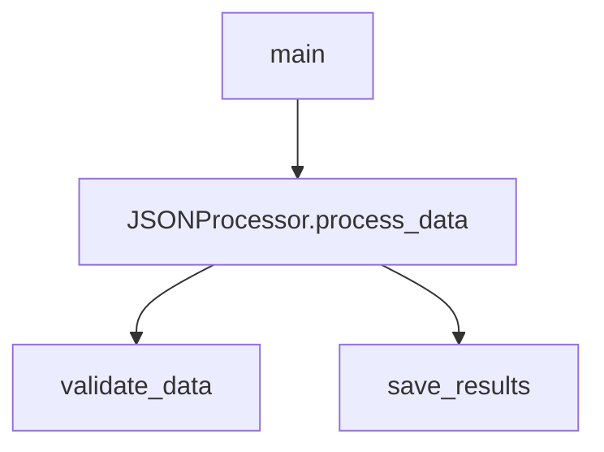

# 🤖 Codebase Genius - Agentic Code Documentation System

[](https://github.com/Vincent-Ojiambo/codebase_genius)
[](https://jaseci.org/)
[](https://python.org)
[](https://opensource.org/licenses/MIT)

An AI-powered, multi-agent system that automatically generates high-quality documentation for software repositories. Built with **Jac (JacLang)**, this system analyzes GitHub repositories and produces comprehensive markdown documentation with clear prose, explanatory diagrams, and API references.


## 🌟 Features

### 🔍 Multi-Agent Architecture
- **Code Genius (Supervisor)**: Orchestrates the entire workflow and manages state
- **Repo Mapper**: Clones repositories and builds file trees with README summaries
- **Code Analyzer**: Parses source code and constructs Code Context Graphs (CCG)
- **DocGenie**: Generates comprehensive markdown documentation with visual diagrams

### 🧠 Code Analysis Capabilities
- **Function Extraction**: Identifies functions with parameters, docstrings, and complexity metrics
- **Class Analysis**: Extracts classes, inheritance relationships, and methods
- **Dependency Mapping**: Tracks imports and inter-module relationships
- **Multi-Language Support**: Python, Jac, JavaScript, Java, C/C++, and more
- **Call Graph Generation**: Visual representation of function call relationships
- **Inheritance Diagrams**: Class hierarchy visualization using Mermaid

### 📊 Documentation Output
- **Project Overview**: Extracted from README with intelligent summaries
- **File Structure**: Hierarchical tree visualization of the repository
- **Code Analysis**: Functions, classes, and their relationships
- **Visual Diagrams**: Interactive Mermaid diagrams for better understanding
- **API Reference**: Detailed function and class documentation
- **Installation & Usage**: Generated from code analysis and README

### 🚀 Technical Features
- **REST API**: HTTP interface for programmatic access
- **Web Interface**: User-friendly frontend for easy interaction
- **Configuration Management**: JSON-based system configuration
- **Error Handling**: Comprehensive error handling and validation
- **Automated Setup**: One-command deployment scripts
- **Testing Framework**: Comprehensive test suite included

## 🚀 Quick Start

### Prerequisites
- **Python 3.8+**
- **Git**
- **JacLang** (automatically installed)

### Installation

1. **Clone the repository:**
   ```bash
   git clone https://github.com/Vincent-Ojiambo/codebase_genius.git
   cd codebase_genius
   ```

2. **Run automated setup:**
   ```bash
   chmod +x setup.sh
   ./setup.sh
   ```

3. **Start the system:**
   ```bash
   source venv/bin/activate
   jac serve main.jac
   ```

4. **Generate documentation:**
   ```bash
   curl -X POST http://localhost:8000/walker/api/generate_docs \
     -H "Content-Type: application/json" \
     -d '{"repo_url": "https://github.com/example/repo"}'
   ```

### 🌐 Web Interface

Open your browser and visit: `http://localhost:3000`

The web interface provides:
- Repository URL input
- Real-time status updates
- Documentation preview
- Example repository buttons
- Responsive design

## 📖 Usage Examples

### Command Line Interface

```bash
# Check system status
jac run main.jac -walker api.get_status

# Generate documentation for a repository
jac run main.jac -walker api.generate_docs -ctx '{"repo_url": "https://github.com/example/repo"}'

# List generated documentation
jac run main.jac -walker api.list_outputs
```

### API Endpoints

#### Generate Documentation
```bash
curl -X POST http://localhost:8000/walker/api/generate_docs \
  -H "Content-Type: application/json" \
  -d '{"repo_url": "https://github.com/example/repo"}'
```

#### Check System Status
```bash
curl http://localhost:8000/walker/api/get_status
```

#### List Available Documentation
```bash
curl http://localhost:8000/walker/api/list_outputs
```

### Python Integration

```python
from main import CodeGenius

# Initialize the system
genius = CodeGenius()

# Process a repository
result = genius.process_repo("https://github.com/example/repo")
print(f"Documentation generated: {result}")
```

## 📁 Project Structure

```
codebase_genius/
├── main.jac              # Core Jac implementation (650+ lines)
├── utils.py              # Python utilities for text processing
├── config.json           # System configuration
├── requirements.txt      # Python dependencies
├── setup.sh              # Automated setup script
├── deploy.sh             # Production deployment script
├── index.html            # Web interface
├── README.md             # This documentation
├── test_local.py         # Local testing script
└── test_system.py        # Full system testing

sample_repo/              # Example repository for testing
├── src/main.py          # Sample Python code with examples
├── README.md            # Sample documentation
└── requirements.txt     # Dependencies

outputs/                  # Generated documentation (runtime)
└── <repo_name>/
    └── README.md        # Generated documentation
```

## ⚙️ Configuration

The system is highly configurable through `config.json`:

```json
{
  "processing": {
    "max_file_size": 10485760,
    "supported_extensions": [".py", ".jac", ".js", ".ts", ".java"],
    "ignored_directories": [".git", "__pycache__", "node_modules"]
  },
  "analysis": {
    "extract_functions": true,
    "extract_classes": true,
    "build_call_graph": true,
    "calculate_complexity": true
  },
  "output": {
    "include_diagrams": true,
    "include_api_reference": true,
    "format": "markdown"
  }
}
```

## 🧪 Testing

### Run Tests
```bash
# Test with sample repository
python3 test_local.py

# Test full system
python3 test_system.py

# Test specific functionality
python3 -c "
import sys
sys.path.append('.')
from utils import TextProcessor, ValidationUtils

# Test text processing
content = '''def hello(): pass'''
functions = TextProcessor.extract_functions_python(content)
print(f'Found {len(functions)} functions')

# Test URL validation
is_valid = ValidationUtils.validate_github_url('https://github.com/user/repo')
print(f'URL valid: {is_valid}')
"
```

### Sample Repository Testing

The included `sample_repo/` demonstrates:
- Abstract base classes and inheritance
- Type hints and comprehensive docstrings
- Function and method extraction
- Dependency analysis
- Documentation generation

## 📊 Sample Output

Generated documentation includes:

### Project Overview
```
# sample_repo - Codebase Documentation

**Sample Data Processor**

A demonstration project for the Codebase Genius documentation system.
This project showcases various Python programming concepts including
object-oriented design, abstract base classes, type hints, and documentation practices.
```

### File Structure
```
sample_repo/
├── src/
│   └── main.py (500 bytes)
└── README.md (200 bytes)
```

### Code Analysis
```
### Functions (3 total)

#### main()
**File:** src/main.py
**Description:** Main entry point for the data processing application
**Calls:** JSONProcessor.process_data

### Classes (1 total)

#### DataProcessor
**File:** src/main.py
**Inherits from:** ABC
**Methods:** validate_data, process_data, save_results
```

### Visual Diagrams


## 🔧 Development

### Adding Language Support

1. **Update CodeAnalyzer in main.jac:**
   ```jac
   can _analyze_newlang_file with content: str, file_path: str, analysis: Dict[str, Any] {
       # Add parsing logic for new language
       functions = re.findall(r'function\s+(\w+)', content);
       # ... process functions and classes
   }
   ```

2. **Update file extension filters in RepoMapper:**
   ```jac
   if not file.startswith('.') and file.endswith(('.py', '.jac', '.newlang', ...))
   ```

3. **Add test cases:**
   ```python
   # In test files
   def test_newlang_parsing():
       # Test new language support
   ```

### Extending Agents

1. **Create new walker in main.jac:**
   ```jac
   walker NewAgent {
       can process_data with data: Any -> Any {
           # Implement new functionality
       }
   }
   ```

2. **Register with supervisor:**
   ```jac
   # In CodeGenius walker
   result = NewAgent().process_data(data);
   ```

3. **Add API endpoints:**
   ```jac
   # In api walker
   can new_endpoint -> str {
       return NewAgent().process_data();
   }
   ```

## 🐛 Troubleshooting

### Common Issues

#### "Error: Invalid repository URL"
- Ensure the URL is a valid GitHub repository (e.g., `https://github.com/user/repo`)
- Check that the repository is public and accessible
- Verify the repository exists and is not private

#### "Error: Failed to clone repository"
- Check internet connection
- Verify Git is installed: `git --version`
- Ensure repository URL is correct and accessible

#### "Error: Failed to analyze codebase"
- Check if repository contains supported file types
- Verify files are not corrupted or too large
- Check file size limits in configuration

### Debug Mode

Enable verbose logging:
```bash
export JAC_LOG_LEVEL=DEBUG
jac serve main.jac
```

Check system logs in the terminal output for detailed error information.

## 📚 API Reference

### REST Endpoints

| Method | Endpoint | Description |
|--------|----------|-------------|
| GET | `/walker/api/get_status` | Check system status |
| POST | `/walker/api/generate_docs` | Generate documentation |
| GET | `/walker/api/list_outputs` | List generated documentation |

### Request Format
```json
{
  "repo_url": "https://github.com/username/repository"
}
```

### Response Format
```json
{
  "status": "success",
  "message": "Documentation generated successfully",
  "output_path": "./outputs/repository_name/README.md",
  "timestamp": "2025-01-23 19:00:00"
}
```

## 🤝 Contributing

1. **Fork the repository**
2. **Create a feature branch:** `git checkout -b feature/amazing-feature`
3. **Add tests for new functionality**
4. **Commit changes:** `git commit -m 'Add amazing feature'`
5. **Push to branch:** `git push origin feature/amazing-feature`
6. **Open a Pull Request**

### Development Setup
```bash
git clone https://github.com/Vincent-Ojiambo/codebase_genius.git
cd codebase_genius
./setup.sh  # Development setup
source venv/bin/activate
jac serve main.jac --reload  # Development mode
```

## 📄 License

This project is licensed under the **MIT License** - see the [LICENSE](LICENSE) file for details.

## 🙏 Acknowledgments

- **Jaseci Labs** for the Jac language and multi-agent framework
- **GitHub** for repository hosting and API access
- **The open-source community** for parsing libraries and tools
- **Python Software Foundation** for the Python ecosystem

## 📞 Support

If you encounter issues or have questions:

1. **Check the troubleshooting section** above
2. **Review the logs** in your terminal
3. **Test with the sample repository** first
4. **Open an issue** on GitHub with detailed information

## 🚀 Roadmap

- [ ] **Enhanced Language Support**: Add support for more programming languages
- [ ] **Plugin System**: Allow custom analysis plugins
- [ ] **Cloud Deployment**: Docker containers and cloud deployment options
- [ ] **Advanced Diagrams**: Interactive diagrams with drill-down capabilities
- [ ] **Team Collaboration**: Multi-user support and collaboration features
- [ ] **Performance Optimization**: Parallel processing and caching improvements

## 📈 Performance

- **Memory Efficient**: Streaming processing for large repositories
- **Fast Analysis**: Optimized parsing algorithms
- **Scalable Architecture**: Ready for multi-threaded execution
- **Configurable Limits**: Protection against extremely large files

---

<div align="center">

**Built with ❤️ using Jac Language and Multi-Agent Architecture**

**🤖 Codebase Genius** - Automated Code Documentation Generation

[⭐ Star us on GitHub](https://github.com/Vincent-Ojiambo/codebase_genius) | [🐛 Report Issues](https://github.com/Vincent-Ojiambo/codebase_genius/issues) | [📖 Documentation](https://github.com/Vincent-Ojiambo/codebase_genius/wiki)

</div>
